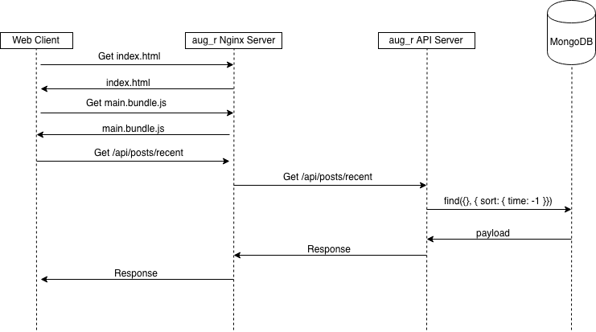
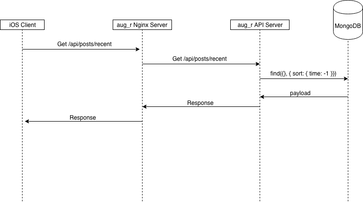

# aug_r Documentation
This document describes the high level architecture of the aug_r platform.

## Product Narrative
We’re building an iOS app and a web service to create a marketplace for hosting, viewing and sharing mixed and augmented reality content in order to rethink the entertainment experience. We aim to democratize the distribution of next generation immersive content.

## Parts
aug_r is a full stack web app intended to run in the cloud, with a few different parts:

1. A [React.js](https://reactjs.org/) based front-end for managing content
2. An [Express.js](https://expressjs.com/) web server for serving up the react front end and for running a REST API 
3. An iOS app for viewing, searching, and consuming content
4. A [MongoDB](https://www.mongodb.com/) database for storing the information about each post
5. An [S3 bucket](https://aws.amazon.com/s3/) for hosting the video files uploaded by users

The infrastructure will be hosted on [AWS](https://aws.amazon.com/). Currently, the plan is to have a single EC2 instance for both the web server and database, with only the web server being exposed to the web. This web server will sit behind an Nginx reverse proxy server. 

## Programming Model
In order to add features to to our platform, the development is split up into a couple of pieces. 

First, a data model needs to defined, and maybe a couple of sample entries are added to the database. Since Mongo is a schema-less database, this process is less formal; essentially, a JSON object should be defined with all the keys and types of data expected. 

Second, methods need to be defined to retrieve this type of data from the database in the API, and a route added to the API that uses these methods. This is how we expose new functionality to an end user component.

Third, the front end pieces need to be updated to utilize these new resources wherever appropriate. For example, adding a new type of search functionality to the app makes sense to exist on the iOS app, which is where an end user would be searching content, but not on the React frontend, since this is designed for creators.

Finally, all this needs to be deployed simultaneously.

## Architecture
The flow of interactions can be seen on the diagrams below. 

### Web
The web client requests the frontend bundle from the Nginx server, which sends it over for the client to then render. Then, as the client uses the app, requests are made to the API server, which also sits behind the Nginx server. The client has all the templates it needs to render responses from the API, and knows where to get which pieces from the API from. 



### iOS
The iOS client already has the frontend code in their app. As the client uses the app, requests are made to the same API server, which also sits behind the Nginx server. The client has all the templates it needs to render responses from the API, and knows where to get which pieces from the API from.




## React Frontend App
[Repo can be found here](https://github.com/aug-r/website)

The front end is bundled into three files using webpack: `index.html`, `main.bundle.js`, and `main.bundle.css`. These files contain the entire app, which is rendered entirely on the client's browser. Thus, the server simply needs to send these static files to the client without doing any more work.

### Frameworks & Technologies Used

* [React.js](reactjs.org), a component based, declarative, client-side UI library
* [MaterialzeCSS](http://materializecss.com), a CSS file implementing material design elements (NOTE: only the CSS file from this framework and nothing more
* [React Router](https://reacttraining.com/react-router/), a declarative routing library for navigating throughout the app


## API Server/Back End
[Repo can be found here](https://github.com/aug-r/website)

The API Server is actually contained within the Express server, with all API routes prefixed with `/api`.

### Frameworks & Technologies Used
* [Express.js](https://expressjs.com/), a simple, lightweight, Node based HTTP server

### Routes
Please see the REST table below for routes currently implemented by the API server:

| Method | Route |  Action | Query | Parameters |
| --------- | ----- | ------- | ----- | ---------- | 
| GET | /api/posts/one | get one post | none | none |
| GET | /api/posts/recent | get n most recent posts | number\_of\_posts | none |
| GET | /api/posts/search | search for a specific post by title | post_title | none |
| GET | /api/posts/:id | get a specific post by id | none | id |


## Database
Our database is an instance of MongoDB, with one collection so far called `posts`. This collection has documents of the following format:
``` json
{
    "title": "Post Title",
    "tags": ["tag1", "tag2"],
    "timestamp": "HH:MM:SS AM UTC",
    "date": "MM/DD/YYYY",
    "link": "S3 Link",
    "id": 1
}
```


